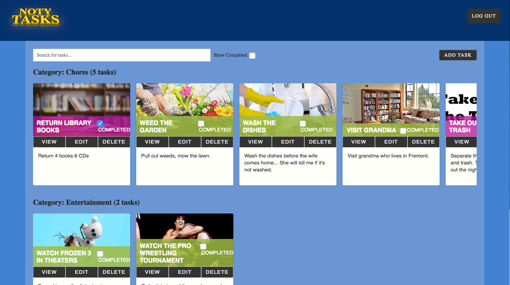
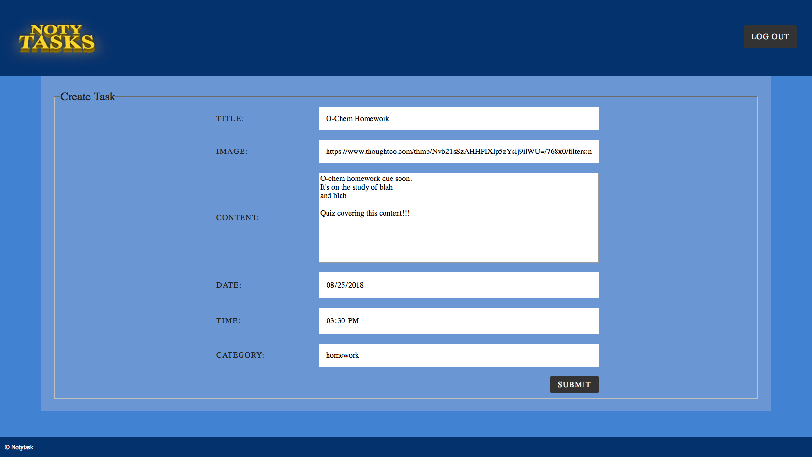
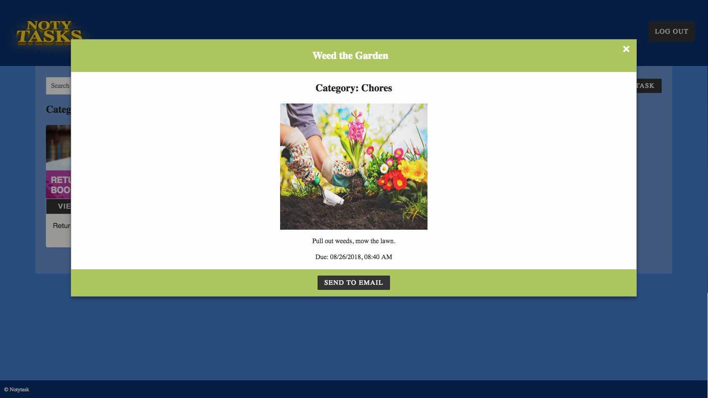
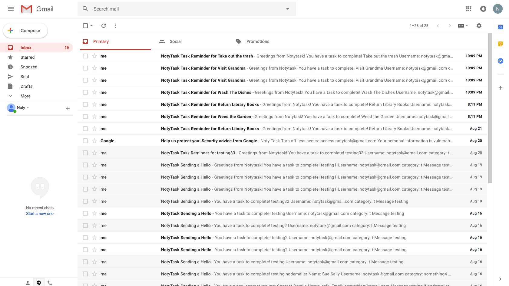

# NotyTasks
Is it read as Know thy tasks?

Is it read as Nody Tasks? since it's made using Node

Is it No thank you Tasks?

In the end, the thing that this site has in common is that you can edit and manage tasks.

## Live App Link
**[Link to Notytask Landing Page](https://notytasks.herokuapp.com/ "notytask website")**

## Technology Used
- [CSS](https://developer.mozilla.org/en-US/docs/Web/CSS "CSS")
- [HTML](https://developer.mozilla.org/en-US/docs/Web/HTML "HTML") 
- [JavaScript](https://www.javascript.com/ "Javascript")
- [JQuery](https://jquery.com/ "JQuery")
- [Ajax](http://api.jquery.com/jquery.ajax/ "Ajax")
- [Node.js](https://nodejs.org/en/ "Node.js")
- [Express](http://expressjs.com/ "Express") 
- [MongoDB](https://www.mongodb.com/ "MongoDB")
- [Mongoose](http://mongoosejs.com/ "Mongoose") 
- [Morgan](https://www.npmjs.com/package/morgan "Morgan")
- [Body-parser](https://www.npmjs.com/package/body-parser "Body-parser")
- [Passport.js](http://www.passportjs.org/ "Passport")
- [Bcrypt.js](https://www.npmjs.com/package/bcryptjs "Bcrypt.js")
- [JSON Web Token](https://jwt.io/ "JSON Web Token")
- [Travis CI](https://travis-ci.org/ "Travis CI")
- [Heroku](https://www.heroku.com/ "Heroku")
- [Dotenv](https://www.npmjs.com/package/dotenv "Dotenv")
- [Chai](http://chaijs.com/ "Chai")
- [Chai-http](http://chaijs.com/plugins/chai-http/ "Chai-http")
- [Mocha](https://www.npmjs.com/package/mocha "Mocha")
- [Path](https://www.npmjs.com/package/path "Path")
- [Modernizr](https://modernizr.com/ "Modernizr")
- [Moment.js](https://momentjs.com/ "Moment.js")
- [Lodash.js](https://lodash.com/ "Lodash.js")

## Screenshot of Notytask Login Screen

### Summary 
The image shows the user a simple login page with three options:
1. Sign Up button: for users to enter their [first name, last name, e-mail, password]
2. Login Section: takes in e-mail and password. Users can enter in the dummy account information located on left side.
3. Mini image gallery on what you can expect

## Screenshot of Notytask User's Task Screen

### Summary
This page is where the real content of the app is located.
There are 9 things users can do on this page.
1. Text Logo: located on the top left will always bring you back to Task page, unless you signed out
2. Log Out: Located top right, will log users out and return you to login page
3. Search for tasks: it currently takes in exact task title and filters out all other tasks except your search query
4. Show Completed: will only display all completed tasks colored in some light red color
5. Add Task: Will redirect you to a form to add a task.
6. View: will display a modal with a larger display of task with image, content and option to mail your task to yourself (only if you provided a real e-mail).
7. Edit Task: Will bring you to a similar to the Add task form, but prefilled with your previous information
8. Delete Task: this will delete your task, there's a small confirmation box before you delete
9. Completed Checkbox: this will change the color of your task and affects the show completed

## Screenshot of Notytask Add Task Screen

### Summary:
This is the page where we add in tasks

This form takes in Title, Image, Content, Date, Time, and a Category to help sort tasks

Image upload TBD once I figure out how to apply Cloudinary

## View Task Modal

### Summary
This screen shows an overview of the task. There are two things users can do on this page.
1. Send Email: this sends an e-mail of the task to your e-mail from username.
2. You can exit the modal view by typing the 'x' on top right or tapping outside the modal.

## E-mail inbox screen

### Summary
An image showing the tasks successfully sent to user's e-mail.

## Design Suggestions:
- ~~Implement Date and Time correctly~~
- ~~add in a Sign Out~~
- ~~Separate Tasks into categories organized by most recent tasks due~~
- ~~Search tasks feature~~
- ~~Make it so username is in e-mail format~~
- ~~figure out how to send an e-mail with tasks~~
- reset search filter
- ~~make view tasks as a modal~~
- ~~DELETE: ask if users really want to delete~~
- ~~notifications to notify completion~~
- ~~make content box of forms larger~~
  - ~~HIGHLIGHT missing fields~~
- ~~for task preview, show snippet of content box~~
- ~~show completed has 1st task stretched out: flex related~~
- ~~add task to far right~~
- ~~fix the show completed~~
- ~~adjust search box to be a bit bigger~~
- ~~get rid of close button in view task~~
- ~~more margin/padding to send to email button~~
- ~~color code completed and pending tasks~~
- possibly allow users to upload image, Cloudinary currently doesn't work
- would love categories drop down menu
- would like more forms of filters
- would like tasks organized by due dates
- landing page
  - sales pitch
  - ~~login sign up side by side maybe?~~
    - ~~click login shows login and vice versa~~
  - set up dummy account for usage
- refactor the code
- Prettify with CSS and things
  - find color scheme of site you like
- don't forget accessibility!
